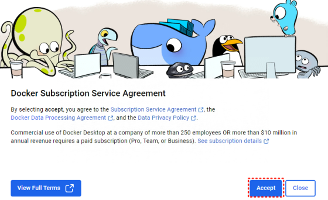
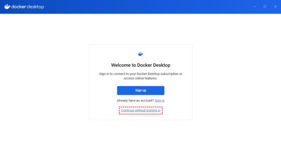
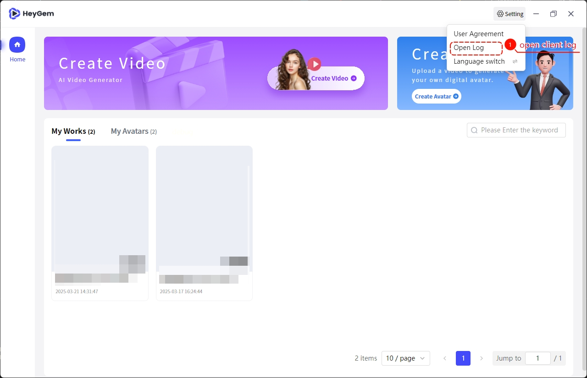
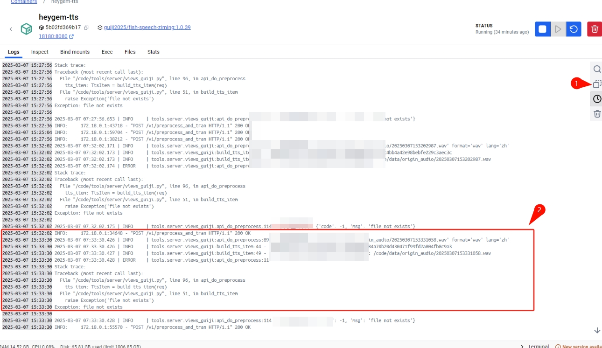

<div style="width: 100%; text-align: center;">
  
</div>

<div style="width: 100%; text-align: center;">
  <h1>HeyGem - Open Source Alternative to Heygen</h1>
</div>


# Table of Contents

1. [What's HeyGem](#1-whats-heygem)
2. [Introduction](#2-introduction)
3. [How to Run Locally](#3-how-to-run-locally)
4. [Open APIs](#4-open-apis)
5. [What's New](#5-whats-new)
6. [FAQ](#6-faq)
7. [How to Interact in real time](#7-how-to-interact-in-real-time)
8. [Contact](#8-contact)
9. [License](#9-license)
10. [Acknowledgments](#10-acknowledgments)
11. [Star History](#11-star-history)

------

## 1. What's HeyGem

**HeyGem** is a free and open-source AI avatar project developed by **Duix.com**.

Seven years ago, a group of young pioneers chose an unconventional technical path, developing a method to train digital human models using real-person video data. Unlike traditional costly 3D digital human approaches, we leveraged AI-generated technology to create ultra-realistic digital humans, slashing production costs from hundreds of thousands of dollars to just $1,000. This innovation has empowered over 10,000 enterprises and generated over 500,000 personalized avatars for professionals across fields – educators, content creators, legal experts, medical practitioners, and entrepreneurs – dramatically enhancing their video production efficiency. However, our vision extends beyond commercial applications. We believe this transformative technology should be accessible to everyone. To democratize digital human creation, we've open-sourced our cloning technology and video production framework. Our commitment remains: breaking down technological barriers to make cutting-edge tools available to all. Now, anyone with a computer can freely craft their own AI Avatar and produce videos at zero cost – this is the essence of  **HeyGem**.


## 2. Introduction


Heygem is a fully offline video synthesis tool designed for Windows systems that can precisely clone your appearance and voice, digitalizing your image. You can create videos by driving virtual avatars through text and voice. No internet connection is required, protecting your privacy while enjoying convenient and efficient digital experiences.

- Core Features
  - Precise Appearance and Voice Cloning: Using advanced AI algorithms to capture human facial features with high precision, including facial features, contours, etc., to build realistic virtual models. It can also precisely clone voices, capturing and reproducing subtle characteristics of human voices, supporting various voice parameter settings to create highly similar cloning effects.
  - Text and Voice-Driven Virtual Avatars: Understanding text content through natural language processing technology, converting text into natural and fluent speech to drive virtual avatars. Voice input can also be used directly, allowing virtual avatars to perform corresponding actions and facial expressions based on the rhythm and intonation of the voice, making the virtual avatar's performance more natural and vivid.
  - Efficient Video Synthesis: Highly synchronizing digital human video images with sound, achieving natural and smooth lip-syncing, intelligently optimizing audio-video synchronization effects.
  - Multi-language Support: Scripts support eight languages - English, Japanese, Korean, Chinese, French, German, Arabic, and Spanish.
- Key Advantages
  - Fully Offline Operation: No internet connection required, effectively protecting user privacy, allowing users to create in a secure, independent environment, avoiding potential data leaks during network transmission.
  - User-Friendly: Clean and intuitive interface, easy to use even for beginners with no technical background, quickly mastering the software's usage to start their digital human creation journey.
  - Multiple Model Support: Supports importing multiple models and managing them through one-click startup packages, making it convenient for users to choose suitable models based on different creative needs and application scenarios.
- Technical Support
  - Voice Cloning Technology: Using advanced technologies like artificial intelligence to generate similar or identical voices based on given voice samples, covering context, intonation, speed, and other aspects of speech.
  - Automatic Speech Recognition: Technology that converts human speech vocabulary content into computer-readable input (text format), enabling computers to "understand" human speech.
  - Computer Vision Technology: Used in video synthesis for visual processing, including facial recognition and lip movement analysis, ensuring virtual avatar lip movements match voice and text content.


## 3. How to Run Locally

HeyGem supports Docker-based rapid deployment. Prior to deployment, ensure your hardware and software environments meet the specified requirements.

HeyGem support two deployment modes：Windows / Ubuntu 22.04 Installation

### **Dependencies**

1. Nodejs 18
2. Docker Images
   - docker pull guiji2025/fun-asr
   - docker pull guiji2025/fish-speech-ziming
   - docker pull guiji2025/heygem.ai


### **Mode 1：Windows** Installation

**System Requirements:**

- Currently supports Windows 10 19042.1526 or higher

**Hardware** **Requirements****：**

- Must have D Drive: Mainly used for storing digital human and project data
  - Free space requirement: More than 30GB
- C Drive: Used for storing service image files
  - Free space requirement: More than 100GB
  - If less than 100GB is available, after installing Docker, you can choose a different disk folder with more than 100GB of remaining space at the location shown below.


- Recommended Configuration:
  - CPU: 13th Gen Intel Core i5-13400F
  - Memory: 32GB
  - Graphics Card: RTX 4070
- Ensure you have an NVIDIA graphics card with properly installed drivers

NVIDIA driver download link: https://www.nvidia.cn/drivers/lookup/


#### **Installing Windows Docker**

1. Use the command `wsl --list --verbose` to check if WSL is installed. If it shows as below, it's already installed and no further installation is needed.


1. Update WSL using `wsl --update`.


1. [Download Docker for Windows](https://www.docker.com/), choose the appropriate installation package based on your CPU architecture.
2. When you see this interface, installation is successful.


1. Run Docker


1. Accept the agreement and skip login on first run






#### **Installing the Server**

Installation using Docker, docker-compose as follows:

1. The `docker-compose.yml` file is in the `/deploy` directory.
2. Execute `docker-compose up -d` in the `/deploy` directory, if you want to use the lite version, execute `docker-compose -f docker-compose-lite.yml up -d`
3. Wait patiently (about half an hour, speed depends on network), download will consume about 70GB of traffic, make sure to use WiFi
4. When you see three services in Docker, it indicates success (the lite version has only one service `heygem-gen-video`)


#### **Server Deployment Solution for NVIDIA 50 Series Graphics Cards**

For 50 series graphics cards (tested and also works for 30/40 series with CUDA 12.8) Uses the official preview version of PyTorch

#### **Client**

1. Directly download the [officially built installation package](https://github.com/GuijiAI/HeyGem.ai/releases)
2. Double-click `HeyGem-x.x.x-setup.exe` to install


### **Mode 2：**Ubuntu 22.04 Installation

**System Requirements****：**

We have conducted a complete test on **Ubuntu 22.04**. However, theoretically, it supports desktop Linux distributions.

**Hardware** **Requirements****：**

- Recommended Configuration
- CPU: 13th Generation Intel Core i5 - 13400F
- Memory: 32G or more (necessary)
- Graphics Card: RTX - 4070 (Ensure you have an NVIDIA graphics card and the graphics card driver is correctly installed)
- Hard Disk: Free space greater than 100G

**Install Docker:**

First, use` docker --version` to check if Docker is installed. If it is installed, skip the following steps.

```
sudo apt update
sudo apt install docker.io
sudo apt install docker-compose
```

**Install the graphics card driver:**

1. Install the graphics card driver by referring to the official documentation(https://www.nvidia.cn/drivers/lookup/).

After installation, execute the `nvidia-smi` command. If the graphics card information is displayed, the installation is successful.

2. Install the NVIDIA Container Toolkit

​    The NVIDIA Container Toolkit is a necessary tool for Docker to use NVIDIA GPUs. The installation steps are as follows:

- Add the NVIDIA package repository:

```
distribution=$(. /etc/os-release;echo $ID$VERSION_ID) \
  && curl -s -L https://nvidia.github.io/libnvidia-container/gpgkey | sudo apt-key add - \
  && curl -s -L https://nvidia.github.io/libnvidia-container/$distribution/libnvidia-container.list | sudo tee /etc/apt/sources.list.d/nvidia-container-toolkit.list
```

- Update the package list and install the toolkit:

```
sudo apt-get update
sudo apt-get install -y nvidia-container-toolkit
```

- Configure Docker to use the NVIDIA runtime:

```
sudo nvidia-ctk runtime configure --runtime=docker
```

- Restart the Docker service:

```
sudo systemctl restart docker
```

#### **Install the server**

```
cd /deploy
docker-compose -f docker-compose-linux.yml up -d
```

#### **Install the client**

1. Directly download the Linux version of the [officially built installation package](https://github.com/GuijiAI/HeyGem.ai/releases).
2. Double click `HeyGem-x.x.x.AppImage` to launch it. No installation is required.

Reminder: In the Ubuntu system, if you enter the desktop as the `root` user, directly double - clicking `HeyGem - x.x.x.AppImage` may not work. You need to execute `./HeyGem - x.x.x.AppImage --no - sandbox` in the command - line terminal. Adding the `--no - sandbox` parameter will do the trick.


## 4. Open APIs

We have opened APIs for model training and video synthesis. After Docker starts, several ports will be exposed locally, accessible through `http://127.0.0.1`.

For specific code, refer to:

- src/main/service/model.js
- src/main/service/video.js
- src/main/service/voice.js

### **Model Training**

1. Separate video into silent video + audio
2. Place audio in

`D:\heygem_data\voice\data` is agreed with the `guiji2025/fish-speech-ziming` service, can be modified in docker-compose

1. Call the

Parameter example:Response example:**Record the response results as they will be needed for subsequent audio synthesis**

### **Audio Synthesis**

Interface: `http://127.0.0.1:18180/v1/invoke`

```
// Request parameters
{
  "speaker": "{uuid}", // A unique UUID
  "text": "xxxxxxxxxx", // Text content to synthesize
  "format": "wav", // Fixed parameter
  "topP": 0.7, // Fixed parameter
  "max_new_tokens": 1024, // Fixed parameter
  "chunk_length": 100, // Fixed parameter
  "repetition_penalty": 1.2, // Fixed parameter
  "temperature": 0.7, // Fixed parameter
  "need_asr": false, // Fixed parameter
  "streaming": false, // Fixed parameter
  "is_fixed_seed": 0, // Fixed parameter
  "is_norm": 0, // Fixed parameter
  "reference_audio": "{voice.asr_format_audio_url}", // Return value from previous "Model Training" step
  "reference_text": "{voice.reference_audio_text}" // Return value from previous "Model Training" step
}
```

### **Video Synthesis**

- Synthesis interface: `http://127.0.0.1:8383/easy/submit`

```
// Request parameters
{
  "audio_url": "{audioPath}", // Audio path
  "video_url": "{videoPath}", // Video path
  "code": "{uuid}", // Unique key
  "chaofen": 0, // Fixed value
  "watermark_switch": 0, // Fixed value
  "pn": 1 // Fixed value
}
```

- Progress query: `http://127.0.0.1:8383/easy/query?code=${taskCode}`

GET request, the parameter `taskCode` is the `code` from the synthesis interface input above


### **Important Notice to Developer Partners**

we are now announcing two parallel service solutions:

| **Project**              | **HeyGem Open Source Local Deployment**                      | **Digital Human/Clone Voice API Service**                    |
| ------------------------ | ------------------------------------------------------------ | ------------------------------------------------------------ |
| Usage                    | Open Source Local Deployment                                 | Rapid Clone API Service                                      |
| Recommended              | Technical Users                                              | Business Users                                               |
| Technical Threshold      | Developers with deep learning framework experience/pursuing deep customization/wishing to participate in community co-construction | Quick business integration/focus on upper-level application development/need enterprise-level SLA assurance for commercial scenarios |
| Hardware Requirements    | Need to purchase GPU server                                  | No need to purchase GPU server                               |
| Customization            | Can modify and extend the code according to your needs, fully controlling the software's functions and behavior | Cannot directly modify the source code, can only extend functions through API-provided interfaces, less flexible than open source projects |
| Technical Support        | Community Support                                            | Dynamic expansion support + professional technical response team |
| Maintenance Cost         | High maintenance cost                                        | Simple maintenance                                           |
| Lip Sync Effect          | Usable effect                                                | Stunning and higher definition effect                        |
| Commercial Authorization | Supports global free commercial use (enterprises with more than 100,000 users or annual revenue exceeding 10 million USD need to sign a commercial license agreement) | Commercial use allowed                                       |
| Iteration Speed          | Slow updates, bug fixes depend on the community              | Latest models/algorithms are prioritized, fast problem resolution |

We always adhere to the open source spirit, and the launch of the API service aims to provide a more complete solution matrix for developers with different needs. No matter which method you choose, you can always obtain technical support documents through [https://duix.com](https://duix.com/)


We look forward to working with you to promote the inclusive development of digital human technology!


You can chat with Heygem Digital Human on the official website: https://duix.com/

We also provide  APl at DUIX Platform: https://docs.duix.com/api-reference/api/Introduction

## 5. What's New

### **[Nvidia 50 Series GPU Version Notice]**

1. Tested and verified on 5090 GPU
2. For installation instructions, see [Server Deployment Solution for NVIDIA 50 Series Graphics Cards](https://github.com/duixcom/Duix.Heygem?tab=readme-ov-file#Server-Deployment-Solution-for-NVIDIA-50-Series-Graphics-Cards)

### **[New Ubuntu Version Notice]**

**Ubuntu Version Officially Released**

1. Adaptation and verification work for Ubuntu 22.04 Desktop version (kernel 6.8.0-52-generic) has been completed. Compatibility testing for other Linux versions has not yet been conducted.
2. Added internationalization (English) for the client program interface.
3. Fixed some known issues
   - \#304
   - \#292
4. [Ubuntu22.04 Installation Documentation](https://github.com/GuijiAI/HeyGem.ai?tab=readme-ov-file#ubuntu-2204-installation)

## 6. FAQ

### **Self-Check Steps Before Asking Questions**

1. Check if all three services are in Running status


2. Confirm that your machine has an NVIDIA graphics card and drivers are correctly installed.

All computing power for this project is local. The three services won't start without an NVIDIA graphics card or proper drivers.

3. Ensure both server and client are updated to the latest version. The project is newly open-sourced, the community is very active, and updates are frequent. Your issue might have been resolved in a new version.
   - Server: Go to `/deploy` directory and re-execute `docker-compose up -d`
   - Client: `pull` code and re-`build`
4. [GitHub Issues](https://github.com/GuijiAI/HeyGem.ai/issues) are continuously updated, issues are being resolved and closed daily. Check frequently, your issue might already be resolved.

### **Question Template**

1. Problem Description

Describe the reproduction steps in detail, with screenshots if possible.

2. Provide Error Logs
   - How to get client logs:



- Server logs:

Find the key location, or click on our three Docker services, and "Copy" as shown below.



## 7. How to Interact in real time

HeyGem's digital human realizes digital human cloning and non-real-time video synthesis.

If you want a digital human to support interaction, you can visit [duix.com](www.duix.com) to experience the free test.

## 8. Contact

If you have any questions, please raise an issue or contact us at james@duix.com

## 9. License

https://github.com/GuijiAI/HeyGem.ai/blob/main/LICENSE

## 10. Acknowledgments

- ASR based on fun-asr
- TTS based on fish-speech-ziming

## 11. Star History

[GitHub Star History](https://www.star-history.com/#GuijiAI/HeyGem.ai&Date)