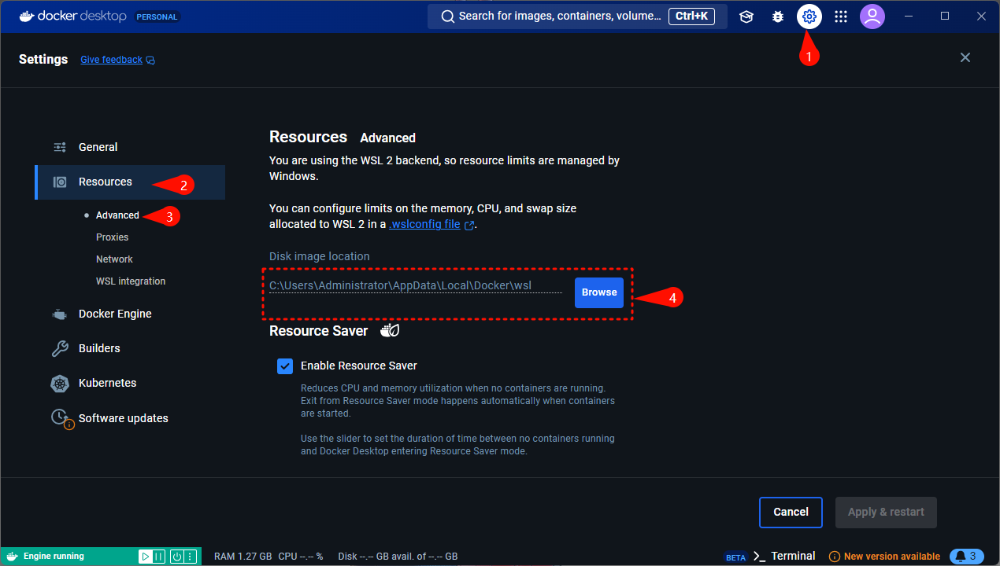
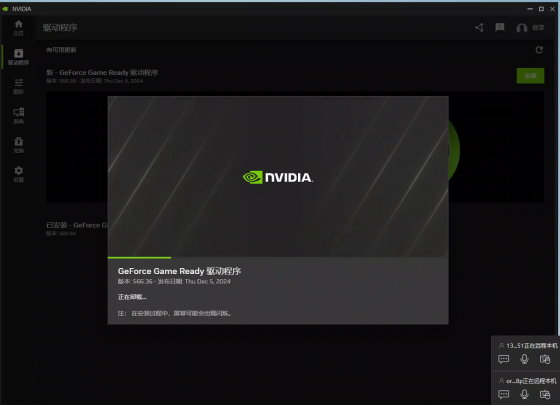
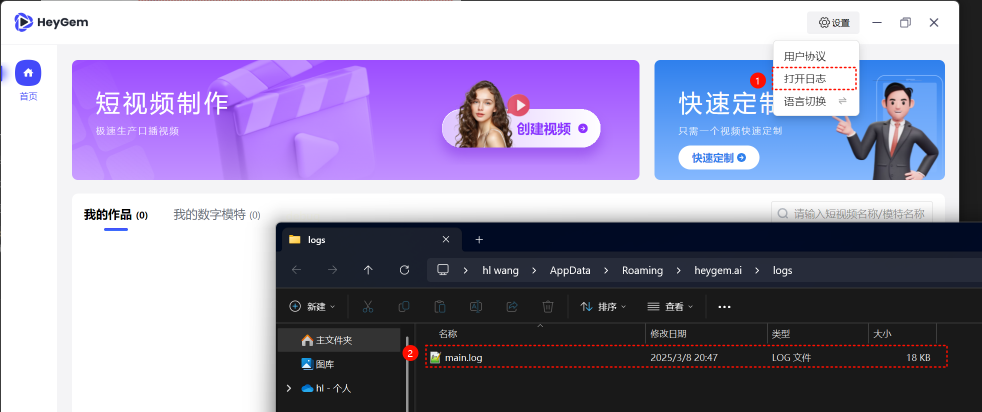
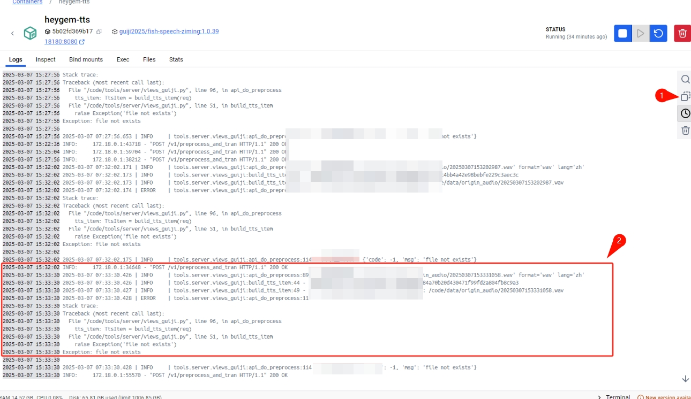

# Heygem - Heygen数字人的开源平替产品 [【Switch to English】](./README.md)
## 【项目介绍】
Heygem数字人是由硅基智能发布的免费开源项目，支持本地部署/API调用。

仅需提交一段10秒左右的视频，即可快速完成数字人形象和声音克隆，输入文案或上传音频即可驱动数字人口型，自动生成口播播报视频。

## 【官方网站】
登录网站体验更多数字人能力： https://duix.com/

技术交流 & 商务合作联系邮箱： james@duix.com

## 【NVIDIA 50系列显卡版本通知】

1. 基于5090显卡测试通过
2. 安装方法见<a href="#Nvidia-50系列显卡服务端部署方案">Nvidia 50系列显卡服务端部署方案</a>

## 【新增Ubuntu版本通知】

**Ubuntu版本正式发布**

1. 目前已完成 Ubuntu 22.04 Desktop 版本（内核 6.8.0-52-generic）的适配验证工作。其他 Linux 版本暂未进行兼容性测试。
2. 补充客户端程序界面国际化（英文）。
3. 修复一些已知问题
   - #304
   - #292
4. [Ubuntu22.04 安装文档](https://github.com/GuijiAI/HeyGem.ai/blob/main/README_zh.md#ubuntu2204-%E5%AE%89%E8%A3%85)

## 【致开发者伙伴】

**亲爱的Heygem开源社区成员：**

衷心感谢各位对Heygem数字人开源项目的热情关注与积极参与！我们注意到部分开发者在本地部署环节遇到挑战，为更好地满足不同场景需求，现同步告知两项并行服务方案：

| **项目** | **HeyGem开源本地部署**                                                             | **数字人/克隆音API接口服务**                                              |
| -------- | ---------------------------------------------------------------------------------- | ------------------------------------------------------------------------- |
| 使用方式 | 开源本地部署                                                                       | 极速克隆API服务                                                           |
| 推荐     | 技术型用户                                                                         | 业务型用户                                                                |
| 技术门槛 | 具备深度学习框架经验/追求深度定制化/希望参与社区共建的开发者                       | 快速业务集成/专注上层应用开发/需企业级SLA保障的商用场景                   |
| 硬件要求 | 需要购买GPU服务器                                                                  | 无需购买GPU服务器                                                         |
| 定制化   | 可以根据自己的需求对代码进行修改和扩展，完全掌控软件的功能和行为                   | 无法直接修改源代码，只能通过API提供的接口进行功能扩展，灵活性不如开源项目 |
| 技术支持 | 社区支持                                                                           | 动态扩容支持 + 专业技术响应团队                                           |
| 维护成本 | 维护成本高                                                                         | 维护简单                                                                  |
| 口形效果 | 效果可用                                                                           | 效果惊艳且更高清                                                          |
| 商用授权 | 支持全球免费商用（用户量超过10万或年营收达1000万美元以上的企业需签署商业许可协议） | 可商用                                                                    |
| 迭代速度 | 更新慢，Bug修复依赖社区                                                            | 最新模型/算法优先适用，问题修复快                                         |

我们始终秉持开源初心，API服务的推出旨在为不同需求的开发者提供更完整的解决方案矩阵。无论您选择哪种方式，都可随时通过james@duix.com获取技术支持文档。期待与各位共同推动数字人技术的普惠发展！

## 【HeyGem数字人技术交流】
扫码加入技术交流群


## 【上线Coze平台】

Heygem 数字人克隆智能体和插件已成功上线至Coze 平台 ，无需复杂部署，即使是小白用户也能轻松上手直接使用。

戳这里直达Coze商店体验👉[硅基智能数字人克隆智能体](https://www.coze.cn/store/agent/7488696243959431206?bid=6ftfk9dtg0g12) | [硅基智能数字人克隆插件](https://www.coze.cn/store/plugin/7488926246634782746)

扫码观看操作视频


## 【开源共创·荣耀共享】

自从我们开源了Heygem，全球极客已在代码宇宙中点亮数字分身矩阵，每个commit都在重构未来！但独乐乐不如众乐乐——现在诚邀各路大神加入「开源共创计划」，让AI创意赋能每个人，一起推动中国AI舰队驶向星辰大海！

1. 共创内容方向

    分享Heygem部署教程、优化指南、实战案例等高质量视频或文章（B站、抖音、小红书、公众号、知乎等）

2. 开源共创特供奖励池（真金白银奉上！）

    （1）基础奖励

       内容获得 20-100 点赞，获评【Heygem.ai 大师奖】及 20 元现金大师🧧

       内容获得 100+ 点赞，获评【Heygem.ai 之神奖】及 50 元现金大神🧧

    （2）特殊成就：

        月度MVP将解锁开源名人堂数字勋章（永久上链）

3. 参与方式

     你的创意发送至至客服小姐姐，加好友备注“姓名+999”


## 共创优秀作品展

[HeyGem数字人一键启动,8G显存可用,模型体积10G,不需要100G硬盘空间,不需要d盘,基于Docker单镜像,硅基开源](https://www.bilibili.com/video/BV1awQqYZEqB/?spm_id_from=333.337.search-card.all.click&vd_source=618f44772c5dafb47317bb728505d79c)

[Ai数字人16-本地部署！最火爆开源数字人HeyGem零基础手把手教学搭建教程，20%生成卡住解决方法，全套简化流程配套文件分享-T8 comfyui教程](https://www.bilibili.com/video/BV1ACQSYEErF/?spm_id_from=333.337.search-card.all.click&vd_source=618f44772c5dafb47317bb728505d79c)

[heygem开源见证历史了！赛博打工人革命啊！](https://www.bilibili.com/video/BV1R3QpYsEY6/?spm_id_from=333.337.search-card.all.click&vd_source=618f44772c5dafb47317bb728505d79c)

[数字人项目Heygem本地部署教程](https://www.bilibili.com/video/BV1eWQ6YgEcp/?spm_id_from=333.337.search-card.all.click&vd_source=618f44772c5dafb47317bb728505d79c)

[真香！从付费到开源，AI数字人将开启新时代](http://xhslink.com/a/rQPYqoDSRih8)

[开源免费的数字人来了，不限次数，快速克隆](http://xhslink.com/a/tX3p5V5tajh8)

[AI数字人免费啦！GitHub爆火项目电脑就能跑](http://xhslink.com/a/8UT1kQ7vxjh8)

[最火爆免费AI数字人，HeyGem V1.0.3，最新更新，一键整合包！口型效果超强，速度飞起，支持长视频、批量生成，8G显存可用！](https://www.bilibili.com/video/BV1SkoCYpEwh/?share_source=copy_web&vd_source=c38dcdb72a68f2a4e0b3c0f4f9a5a03c)

[【HeyGem】一键包 windows直接运行 无需docker 硅基开源数字人](https://www.bilibili.com/video/BV1ZgovYGE3u/)

## 【部署流程】


Heygem是一款专为Windows系统设计的全离线视频合成工具，它能够精确克隆您的外貌和声音，让您的形象数字化。您可以通过文字和语音驱动虚拟形象，进行视频制作。无需联网，保护隐私的同时，也能享受到便捷和高效的数字体验。

- 核心功能
  - 精确外貌与声音克隆：运用先进的 AI 算法，高精度捕捉真人外貌特征，包括五官形状、面部轮廓等，构建逼真虚拟模型。同时，能精准克隆声音，捕捉并还原人声的细微特征，支持多种声音参数设置，可创造与原声高度相似的克隆效果。
  - 文字和语音驱动虚拟形象：通过自然语言处理技术理解文本内容，将文字转换为自然流畅的语音，实现文字驱动虚拟形象。也可直接使用语音输入，让虚拟形象根据语音的节奏、语调等进行相应的动作和表情变化，使虚拟形象的表现更加自然、生动。
  - 高效视频合成：将数字人的视频画面与声音高度同步，实现自然流畅的口型匹配，智能优化音视频同步效果。
  - 多语言：脚本支持八种语言，英语、日语、韩语、中文、法语、德语、阿拉伯语和西班牙语。
- 显著优势
  - 全离线操作：无需联网即可使用，有效保护用户隐私，让用户在安全、独立的环境中进行创作，避免数据在网络传输过程中可能存在的泄露风险。
  - 简单易用：操作界面简洁直观，即使是没有任何技术背景的小白也能轻松上手，快速掌握软件的使用方法，轻松开启数字人创作之旅。
  - 多模型支持：支持导入多个模型，并通过一键启动包进行管理，方便用户根据不同的创作需求和应用场景选择合适的模型。
- 技术支持
  - 声音克隆技术：利用人工智能等先进技术，根据给定的声音样本生成与之相似或相同声音的技术，涵盖语音中的语境、语调、语速等。
  - 自动语音识别：一种能将人类语音中的词汇内容转换为计算机可读输入，也就是转换为文本格式的技术，让计算机能够 “听懂” 人们说的话。
  - 计算机视觉技术：用于视频合成中的视觉处理，包括面部识别、口型分析等，确保虚拟形象的口型与声音和文字内容相匹配。

## 依赖

1. Nodejs 18
2. Docker Image
   - docker pull guiji2025/fun-asr
   - docker pull guiji2025/fish-speech-ziming
   - docker pull guiji2025/heygem.ai

## Windows 安装

### 前置条件

1.  必须有 D 盘：主要用于后续数字人、作品等数据存储
    - 空闲空间要求：大于30G
2.  C 盘：用于存储服务镜像文件

    - 空闲空间要求：大于 100G
    - 如果不足 100G，可以在安装完成docker后，在下图的位置重新选一个剩余空间大于 100G 的磁盘文件夹。

      

3.  系统要求：
    - 目前支持 Windows 10 19042.1526 或更高版本
4.  推荐配置：
    - CPU：第13代英特尔酷睿 i5-13400F
    - 内存：32G及以上（必要）
    - 显卡：rtx-4070
5.  确保有英伟达显卡，并正确安装显卡驱动（必要）

    英伟达驱动下载地址 https://www.nvidia.cn/drivers/lookup/

    

### 安装 Windows Docker

1. 用wsl --list --verbose命令可以查看本机有没有安装过wsl，如下图就是已经安装过，无需再安装

   

> - 安装wsl的命令：`wsl --install`
> - 由于网络原因，可能失败，多试几次
> - 安装过程中需要设置新的用户名和密码，设置并记住

2. 用wsl --update更新wsl。

   

3. [下载 Docker Windows 版](https://www.docker.com/)，根据机器 CPU 架构选择不同的安装包。

4. 出现这个界面表示安装成功。

   

5. 运行 Docker

   

6. 首次运行接受协议和跳过登录

   

   

   

### 安装服务端

采用Docker方式安装，docker-compose如下：

1. `docker-compose.yml`文件在`/deploy`目录下。
2. 在`/deploy`目录执行`docker-compose up -d`，<u>如果您想使用lite版本，请执行`docker-compose -f docker-compose-lite.yml up -d`</u>
3. 耐心等待一段时间（半小时左右，速度取决于网速），下载会消耗70G左右流量，注意连WIFI
4. 看到Dokcer 中出现三个服务，表示成功了（lite版本只有一个服务`heygem-gen-video`）

   

### Nvidia 50系列显卡服务端部署方案

> 针对50系列显卡（经测试30,40系列cuda12.8用户也可以采用这个方案）
> 使用了torch官方的预览版本
```bash
cd /deploy
docker-compose -f docker-compose-5090.yml up -d
```

### 客户端

1. 直接下载[官方构建的安装包](https://github.com/GuijiAI/HeyGem.ai/releases)
2. 双击`HeyGem-x.x.x-setup.exe`即可安装

## Ubuntu22.04 安装

### 推荐配置

 - CPU：第13代英特尔酷睿 i5-13400F
 - 内存：32G及以上（必要）
 - 显卡：rtx-4070（确保有英伟达显卡，并正确安装显卡驱动）
 - 硬盘：空闲空间大于 100G

### 安装 Docker

> 先用`docker --version`检查是否安装了docker，如果安装了，则跳过以下步骤

```bash
sudo apt update
sudo apt install docker.io
sudo apt install docker-compose
```

### 安装显卡驱动

1. 参考官方文档安装显卡驱动[https://www.nvidia.cn/drivers/lookup/](https://www.nvidia.cn/drivers/lookup/)

    > 安装后执行`nvidia-smi`命令，如果显示显卡信息，则安装成功

2. 安装 NVIDIA Container Toolkit

    NVIDIA Container Toolkit 是 Docker 使用 NVIDIA GPU 的必要工具。安装步骤如下：
    - 添加 NVIDIA 包仓库：
      ```bash
      distribution=$(. /etc/os-release;echo $ID$VERSION_ID) \
        && curl -s -L https://nvidia.github.io/libnvidia-container/gpgkey | sudo apt-key add - \
        && curl -s -L https://nvidia.github.io/libnvidia-container/$distribution/libnvidia-container.list | sudo tee /etc/apt/sources.list.d/nvidia-container-toolkit.list
      ```
    - 更新包列表并安装工具包：
      ```bash
        sudo apt-get update
        sudo apt-get install -y nvidia-container-toolkit
      ```
    - 配置 Docker 使用 NVIDIA 运行时：
      ```bash
        sudo nvidia-ctk runtime configure --runtime=docker
      ```
    - 重启 Docker 服务：
      ```bash
        sudo systemctl restart docker
      ```

### 安装服务端

```bash
cd /deploy
docker-compose -f docker-compose-linux.yml up -d
```

> 与windows上拉镜像一样，如果下载太慢，需要指定国内镜像源方法是在`/etc/docker/daemon.json`文件中添加：
>
> ```json
> {
>   "registry-mirrors": [
>     "https://hub.fast360.xyz",
>     "https://hub.littlediary.cn",
>     "https://docker.kejilion.pro",
>     "https://docker.1panelproxy.com"
>   ]
> }
> ```
> 上面四个镜像源，随着时间推移，可能会有变化，请自行搜索最新的镜像源

### 客户端

1. 直接下载[官方构建的安装包](https://github.com/GuijiAI/HeyGem.ai/releases)的Linux版本
2. 双击`HeyGem-x.x.x.AppImage`即可启动，无需安装

  > 提醒：在Ubuntu系统中，如果您使用`root`用户进入桌面，直接双击`HeyGem-x.x.x.AppImage`可能运行不了，需要在命令行终端中执行`./HeyGem-x.x.x.AppImage --no-sandbox`,加上`--no-sandbox`参数即可。

## 开放 API

我们开放了模特训练和视频合成的API，Docker 启动后会在本地暴露几个端口，通过`http://127.0.0.1`可以调用。

具体代码可以参考

- src/main/service/model.js
- src/main/service/video.js
- src/main/service/voice.js

### 模特训练

1. 将视频分离为静音视频 + 音频
2. 音频放到`D:\heygem_data\voice\data`下
   > `D:\heygem_data\voice\data`是与`guiji2025/fish-speech-ziming`服务约定的，可以在docker-compose中修改
3. 调用`http://127.0.0.1:18180/v1/preprocess_and_tran`接口
   > 参数示例：
   >
   > ```json
   > {
   >   "format": ".wav",
   >   "reference_audio": "xxxxxx/xxxxx.wav",
   >   "lang": "zh"
   > }
   > ```
   >
   > 返回示例：
   >
   > ```json
   > {
   >   "asr_format_audio_url": "xxxx/x/xxx/xxx.wav",
   >   "reference_audio_text": "xxxxxxxxxxxx"
   > }
   > ```
   >
   > **记录下返回结果后续音频合成需要用到**

### 音频合成

接口：`http://127.0.0.1:18180/v1/invoke`

```json
// 请求参数
{
  "speaker": "{uuid}", // 一个UUID保持唯一即可
  "text": "xxxxxxxxxx", // 需要合成的文本内容
  "format": "wav", // 固定传参
  "topP": 0.7, // 固定传参
  "max_new_tokens": 1024, // 固定传参
  "chunk_length": 100, // 固定传参
  "repetition_penalty": 1.2, // 固定传
  "temperature": 0.7, // 固定传参
  "need_asr": false, // 固定传参
  "streaming": false, // 固定传参
  "is_fixed_seed": 0, // 固定传参
  "is_norm": 0, // 固定传参
  "reference_audio": "{voice.asr_format_audio_url}", // 上一步“模特训练”的返回值
  "reference_text": "{voice.reference_audio_text}" // 上一步“模特训练”的返回值
}
```

### 视频合成

- 合成接口：`http://127.0.0.1:8383/easy/submit`

  ```json
  // 请求参数
  {
    "audio_url": "{audioPath}", // 音频路径
    "video_url": "{videoPath}", // 视频路径
    "code": "{uuid}", // 唯一key
    "chaofen": 0, // 固定值
    "watermark_switch": 0, // 固定值
    "pn": 1 // 固定值
  }
  ```

- 进度查询：`http://127.0.0.1:8383/easy/query?code=${taskCode}`
  > get 请求，参数`taskCode`是上面合成接口入参中的`code`

## 常见问题

- [常见问题](./doc/常见问题.md)

- [HeyGem 开源数字人常见问题及解决办法](https://jexopm4t2a.feishu.cn/wiki/EjRPwux9DiNUtakOd1BcLQWEn3f))


## 提问前自查步骤

1. 三个服务是否都是Running状态

   

2. 确认机器上是有英伟达显卡且正确安装了驱动程序。

   本项目所有算力都在本地，没有英伟达显卡或没有驱动程序，以上三个服务是启动不了的。

3. 确保服务端和客户端都更新到了最新版本，项目刚开源，社区很活跃，更新也比较频繁，说不定你的问题已经在新版中解决了。

   - 服务端：到`/deploy`目录下重新执行`docker-compose up -d`
   - 客户端：`pull`代码后重新`build`

4. [GitHub Issuse](https://github.com/GuijiAI/HeyGem.ai/issues)持续更新，每天都在解决和关闭问题单，经常看看，也许你的问题已经解决了。

## 提问模板

1. 问题描述

   详细描述一下复现步骤，如有截图最好。

2. 提供报错日志

   - 客户端日志获取方式

     

   - 服务端日志

     找到关键位置，或点开我们的三个Docker服务，如下图操作“复制”。

     

## 联系我们

```
技术交流 & 商务合作联系邮箱： james@duix.com
```

## 协议

[LICENSE](./LICENSE)

## 致谢

- ASR 基于 [fun-asr](https://github.com/modelscope/FunASR)
- TTS 基于 [fish-speech-ziming](https://github.com/fishaudio/fish-speech)

## Star History

[](https://www.star-history.com/#GuijiAI/HeyGem.ai&Date)
