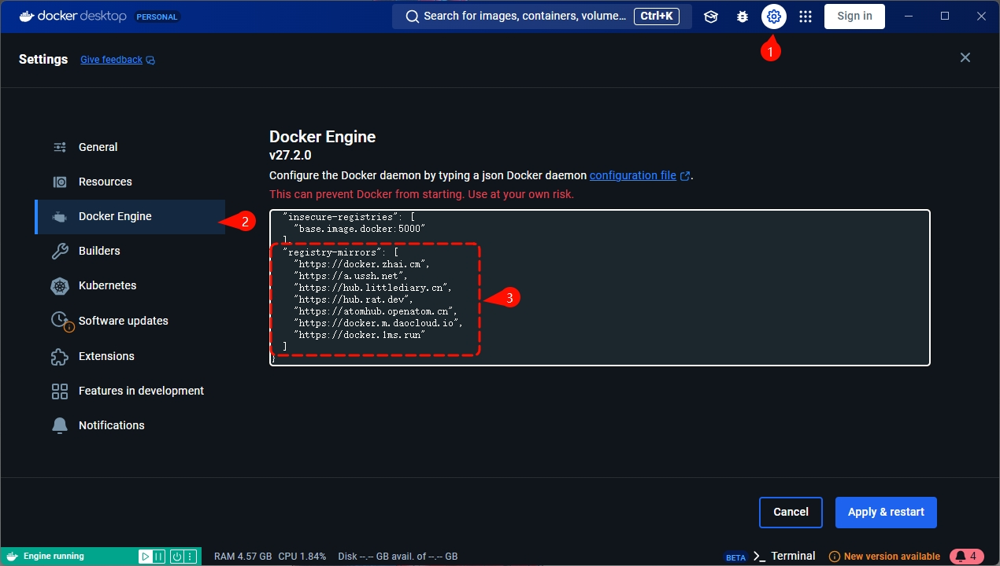

# Heygem

## 自查步骤

1. 三个服务是否都是Running状态

   

2. 确认机器上是有英伟达显卡且正确安装了驱动程序。

   本项目所有算力都在本地，没有英伟达显卡或没有驱动程序，以上三个服务是启动不了的。

3. 确保服务端和客户端都更新到了最新版本，项目刚开源，社区很活跃，更新也比较频繁，说不定你的问题已经在新版中解决了。

   - 服务端：到`/deploy`目录下重新执行`docker-compose up -d`
   - 客户端：`pull`代码后重新`build`

4. [GitHub Issuse](https://github.com/GuijiAI/HeyGem.ai/issues)持续更新，每天都在解决和关闭问题单，经常看看，也许你的问题已经解决了。

## 提问模板

1. 问题描述

   详细描述一下复现步骤，如有截图最好。

2. 提供报错日志

   - 客户端日志获取方式

     

   - 服务端日志

     找到关键位置，或点开我们的三个Docker服务，如下图操作“复制”。

     

## 常见问题

1. 执行`docker-compose up -d`连接失败，报错如下：
    ```shell
    docker-compose up -d
    [+] Running 3/3
    ✘ heygem-asr Error Get "https://registry-1.docker.io/v2/": net/http: request canceled while ... 15.1s
    ✘ heygem-f2f Error context canceled 15.1s
    ✘ heygem-tts Error context canceled 15.1s
    Error response from daemon: Get "https://registry-1.docker.io/v2/": net/http: request canceled while waiting for connection (Client.Timeout exceeded while awaiting headers)
    ```

    

   - Docker Hub 官方源连接不稳定，您需要打开VPN的全局模式

   - 或者使用国内镜像源，如下图设置

     
      ```json
      {
        "builder": {
          "gc": {
            "defaultKeepStorage": "20GB",
            "enabled": true
          }
        },
        "experimental": false,
        "registry-mirrors": [
          "https://docker.zhai.cm",
          "https://a.ussh.net",
          "https://hub.littlediary.cn",
          "https://hub.rat.dev",
          "https://atomhub.openatom.cn",
          "https://docker.m.daocloud.io",
          "https://docker.1ms.run"
        ]
      }
      ```

2. 新增模特时报错如下图：

    

    - 用于创建模特的视频必须有声音，且是人在说话，程序需要用这个声音来做声音克隆

3. heygen-tts 一直重启

    https://github.com/GuijiAI/HeyGem.ai/issues/69

4. 定制模特报错 Connection refused

    日志报错如下：
    ```shell
    2025-03-13 14:38:34.476 | INFO | util.wav_util:format_wav:128 - wav标准格式化成功，/code/data/origin_audio/denoise_20250313223834179.wav -> /code/data/origin_audio/format_denoise_20250313223834179.wav
    2025-03-13 14:38:34.478 | INFO | util.wav_util:clean_wav:156 - 音频清理完成，新文件路径：/code/data/origin_audio/denoise_20250313223834179.wav
    2025-03-13 14:38:34.484 | INFO | util.wav_util:split_audio:95 - 原始音频小于20s，不在分割，直接返回, 时长为：10.587, 文件:/code/data/origin_audio/format_denoise_20250313223834179.wav
    2025-03-13 14:38:34.484 | INFO | asr_fun:asr:102 - fun asr start, wav_path:/code/data/origin_audio/format_denoise_20250313223834179.wav
    2025-03-13 14:38:34.487 | INFO | asr_fun:init_conn:40 - connect to url
    2025-03-13 14:38:34.487 | WARNING | asr_fun:init_conn:53 - 建立funasr连接异常：[Errno 111] Connection refused
    Traceback (most recent call last):
    File "/code/asr_fun.py", line 41, in init_conn
    self.websocket = create_connection(uri, ssl=ssl_context, sslopt=ssl_opt)
    File "/opt/conda/envs/python310/lib/python3.10/site-packages/websocket/_core.py", line 646, in create_connection
    websock.connect(url, **options)
    File "/opt/conda/envs/python310/lib/python3.10/site-packages/websocket/_core.py", line 256, in connect
    self.sock, addrs = connect(
    File "/opt/conda/envs/python310/lib/python3.10/site-packages/websocket/_http.py", line 145, in connect
    sock = _open_socket(addrinfo_list, options.sockopt, options.timeout)
    File "/opt/conda/envs/python310/lib/python3.10/site-packages/websocket/_http.py", line 232, in _open_socket
    raise err
    File "/opt/conda/envs/python310/lib/python3.10/site-packages/websocket/_http.py", line 209, in _open_socket
    sock.connect(address)
    ConnectionRefusedError: [Errno 111] Connection refused
    2025-03-13 14:38:43.357 | ERROR | tools.server.views_guiji:api_do_preprocess:118 - An error occurred: 'NoneType' object has no attribute 'send'
    Stack trace:
    Traceback (most recent call last):
    File "/code/tools/server/views_guiji.py", line 105, in api_do_preprocess
    rt = generate_reference_info(tts_item)
    File "/code/tools/server/views_guiji.py", line 76, in generate_reference_info
    text = asr_fun.asr(a_file)
    File "/code/asr_fun.py", line 120, in asr
    result: dict = rcg.close(timeout=3)
    File "/code/asr_fun.py", line 86, in close
    self.websocket.send(message)
    AttributeError: 'NoneType' object has no attribute 'send'

    2025-03-13 14:38:43.357 | INFO | tools.server.views_guiji:api_do_preprocess:121 - 训练返回结果：{'code': -1, 'msg': "'NoneType' object has no attribute 'send'"}
    ```

    是因为heygem-asr启动比较慢，服务端启动后等几分钟在进行克隆形象操作。如果机器内存太小（比如16G），可能启动不了。